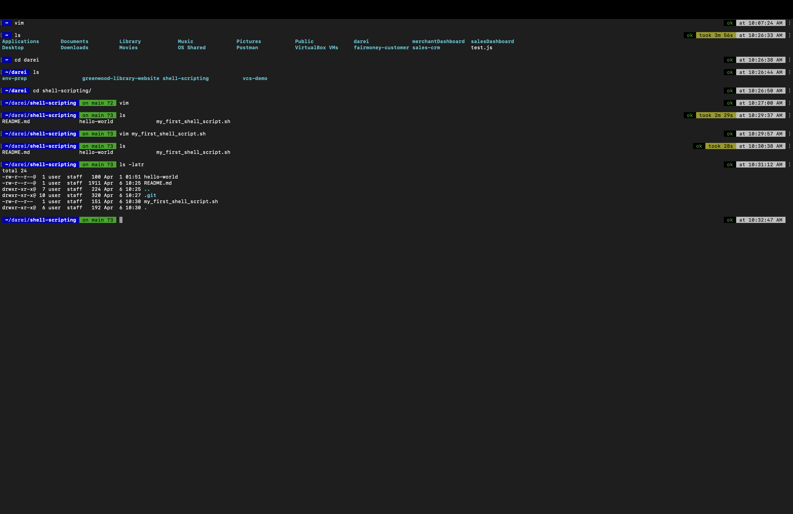

# Linux Shell Scripting

This task takes me through practical steps in learning Linux bash scripting.

---

## Task One
#### Creating Directories

1. I created a folder named **shell-scripting**.
   

2. I used the **cd** command to change into the **shell-scripting** folder before creating the **my_first_shell_script.sh** file.
   

3. Using Vim, I created a file called **my_first_shell_script.sh**.
   

4. I used **ls -latr** to confirm that the file was successfully created.
   

5. I ran the script using **./my_first_shell_script.sh** but got an error: "Permission denied!" because the file wasn't executable, as I noticed in the file listing.
   

---

## Task Two
#### Adding Permissions to the File

1. I added executable permission to the file using **chmod +x my_first_shell_script.sh**.
   

2. I ran the shell script and noticed that only the folders were created.
   

**Note:** I couldn't create the users because I am running Vim and Terminal on macOS, and the `useradd` command is not supported. This is why it didn't run.

---

## Task Three
#### Variable Declaration and Initialization

1. In my shell, I was able to create a variable called `name` and retrieve its value from the terminal.
   

---

## Conclusion

I was able to successfully complete the tasks, including creating directories, adding permissions to files, and working with variables in Linux shell scripting. However, due to the limitations of macOS, I couldn't use the `useradd` command to create users.
